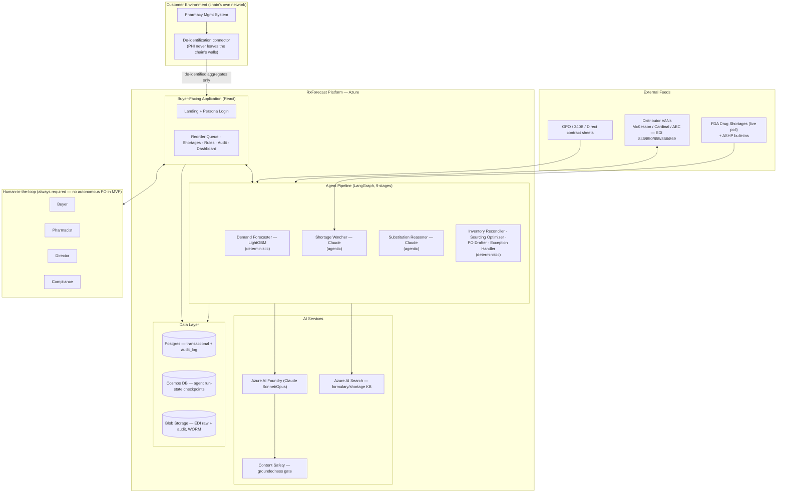

# RxForecast — High-Level Architecture (HLD)

**Purpose:** `PRD.md` says *what* and *why*. `lld.md` says *how it actually runs in production* — full resource-level Azure diagram, database DDL, agent-pipeline internals, EDI wire mechanics. This document sits between them: the big picture a new engineer, stakeholder, or reviewer should read *first* — the major components, how they fit together, and the handful of architectural decisions that shape everything downstream — before dropping into `lld.md`'s full detail. Nothing here invents new scope; every claim traces back to `PRD.md`, `lld.md`, `engg.md`, or the `app/` prototype itself, and is cited accordingly.

---

## 1. System at a Glance

RxForecast is a predictive EDI ordering agent for mid-market pharmacy chains (50–300 stores). Job to be done: **right drug, right store, right time — without stockouts, write-offs, or compliance exposure.** North Star metric: **Net Out-of-Stock Hours per 1,000 Rx dispensed** (lower is better).

Four zones, at the highest level:

Full resource-level detail (Container Apps, Key Vault, Front Door, Service Bus, per-service Managed Identity scoping) is `lld.md` §1 — this diagram deliberately leaves that out to stay readable as a first pass.

---

## 2. Major Components

| Component | What it does | Detail |
|---|---|---|
| **Buyer-Facing Application** | React SPA — landing page, persona-based login, daily reorder queue, shortage alerts, buyer override rules, compliance audit trail, director dashboard. Role-gated: what a user *sees* is enforced client-side via nav visibility; what a user *can do* (store scope, Schedule II block) is enforced server-side regardless of the UI. | `engg.md` Features 0–9, `design-system.md` |
| **Agent Pipeline** | 9-stage LangGraph pipeline, nightly batch + real-time shortage alerts. Only **2 of 9 stages are genuinely agentic** (Shortage Watcher, Substitution Reasoner — both need an LLM because their inputs are unstructured/judgment-based); the other 7 are deterministic code (forecasting model, arithmetic, templating, state machines). | `lld.md` §4, §4.6 (full stage-by-stage table) |
| **AI Services** | Azure AI Foundry hosts the Claude deployment used by the two agentic stages. Azure AI Content Safety screens every Substitution Reasoner output for groundedness before it reaches a buyer — a defense-in-depth layer, not a replacement for the hardcoded Schedule II rule. Azure AI Search holds the formulary/shortage knowledge base for RAG. | `lld.md` §4.5 |
| **Data Layer** | Postgres for transactional data and the append-only `audit_log`; Cosmos DB for agent run-state checkpointing (idempotent per `(run_id, node_name)`); Blob Storage for raw EDI documents and audit artifacts under an immutability (WORM) policy. | `lld.md` §2–3 |
| **EDI Integration** | Inbound/outbound X12 (846/850/855/856/860/869/997) over AS2/SFTP to distributor VANs; real envelope structure and control-number sequencing, not templated text. | `lld.md` §5 |
| **Live Shortage Feed** | Polls FDA's public Drug Shortages API (`api.fda.gov/drug/shortages.json`) on a recurring interval, mapped against the loaded formulary. Feature-flagged in the current build — see §6 below. | `app/backend/src/lib/shortageFeed.js` |
| **Identity** | Customer-facing SSO via Microsoft Entra External ID (per-chain IdP federation); a structurally separate internal Entra tenant for RxForecast's own admin staff, with no trust relationship between the two. | `lld.md` §3.2.1, `engg.md` FEATURE_0/FEATURE_9 |
| **Observability** | Datadog + Azure Monitor for engineering telemetry; a separate in-app Admin Metrics Dashboard (FEATURE_9) for product-level metrics (AI Quality, User Trust, Business, Platform, Compliance, Cost) — different audience, different data shape, different security boundary. | `lld.md` §8, `engg.md` FEATURE_9 |

---

## 3. Data Flow, in Plain Terms

1. **Patient data never leaves the chain's walls.** The pharmacy's dispensing system feeds a de-identification connector that strips everything down to `NDC + store + date + quantity` before anything reaches RxForecast.
2. **Three things get watched nightly:** what each store actually dispensed recently (predicts near-term need), what distributors report in stock (EDI 846), and whether anything's gone into a national shortage (live FDA poll + ASHP).
3. **Two different "brains" for two different jobs.** Predicting *how much* of a drug a store will need is a numbers problem — LightGBM handles that: fast, cheap, auditable. Deciding *what to do* about a shortage or which distributor to substitute from is a reasoning problem — that's Claude's job, because it can read a messy shortage notice, cross-check legal substitute options against DEA schedule and contract terms, and explain its reasoning in plain English with citations.
4. **Nothing ships without a human.** The agent never places an order autonomously. It builds a ranked queue — "these drugs need reordering, here's why, here's what I'd substitute if X is short" — and a buyer approves, edits, or skips. Every recommendation is cited.
5. **The order goes out in the distributor's language** — EDI X12, over the same VAN pipe the pharmacy already uses.
6. **The system watches what happens next.** A 997/855 acknowledgment comes back (sometimes backordered); a backorder triggers automatic re-planning instead of leaving a store short.

---

## 4. Key Architectural Decisions

Each of these overrides or extends something `PRD.md` originally specified — flagged here at a summary level; full rationale lives in `lld.md`.

| Decision | Summary | Detail |
|---|---|---|
| **Full Azure** (not AWS) | A mid-build migration; the Cohort 9 PRD template was itself Azure-centric by default — this moves back to that assumption. | `lld.md` §1 |
| **Claude via Azure AI Foundry** (not direct Anthropic API) | Single-cloud consistency, Managed Identity auth (no API key to rotate), Private Endpoint networking. | `lld.md` §4.5 |
| **Azure AI Search** (not Pinecone), **Azure AI Document Intelligence** (not Google Cloud Vision) | Both substitutions made for single-vendor consistency once hosting moved to Azure — flagged explicitly, not silent swaps. | `lld.md` §1 |
| **LangGraph orchestration, 9-stage pipeline** | Only 2 stages (Shortage Watcher, Substitution Reasoner) are agentic; the rest are deterministic — kept that way deliberately, since a probabilistic model is the wrong tool for a rule that must never have exceptions (e.g. the Schedule II hard-block). | `lld.md` §4.3, §4.6 |
| **Content Safety groundedness gate + Foundry Evaluation SDK** *(added 2026-08-12)* | A real-time groundedness check on every Substitution Reasoner output, plus continuous production-quality scoring that complements — not replaces — the domain-specific offline eval harness. | `lld.md` §4.5, `PRD.md` §7–8 |
| **Live openFDA shortage polling** *(added 2026-08-14, not yet folded into `lld.md`'s diagram — flagged below)* | A genuine, verified-working integration with FDA's public Drug Shortages API, feature-flagged off by default in the current build. | `app/backend/src/lib/shortageFeed.js`, `app/GAPS.md` |
| **Separate internal identity system for RxForecast admins** | The Admin Metrics Dashboard (FEATURE_9) is the single highest-blast-radius surface in the system (cross-chain visibility) — deliberately built on a structurally separate identity, not a `role` value on the customer-facing user model. | `lld.md` §3.2.1, `engg.md` FEATURE_9 |

**Known documentation gap, flagged rather than hidden:** the live openFDA integration was built directly into `app/` code in response to a specific ask, without a corresponding pass through `lld.md`'s architecture diagram or `PRD.md`'s Grounding Strategy section. `lld.md` §1's diagram still shows only the generic "FDA / ASHP feeds" external node — accurate at a conceptual level, but doesn't yet reflect the concrete openFDA endpoint, the query-encoding gotcha found during verification, or the fictional-NDC finding documented in `app/GAPS.md`. Worth a follow-up doc pass if this feature moves toward production.

---

## 5. Current State vs. Target Architecture

This is a course/portfolio project — the diagram in §1 is the **target production architecture**, not what's running today. The actual build is a local prototype, and the gap between the two is tracked deliberately, not glossed over.

| | Target (this doc, `lld.md`) | As-built (`app/`) |
|---|---|---|
| Compute | Azure Container Apps | Two local Node.js processes (`npm run dev`) |
| Data | Postgres + Cosmos DB, partitioned, append-only audit | In-memory JS arrays — resets on restart |
| Auth | Entra External ID SSO + MFA + JWT | Role-picker, opaque bearer token, no expiry |
| Shortage Watcher | Claude via Foundry, RAG over Azure AI Search | Template logic by default; **real live FDA polling exists and works, feature-flagged off** (`SHORTAGE_FEED_ENABLED`) |
| Substitution Reasoner | Claude via Foundry + Content Safety gate | Template logic by default; **real Foundry/Content Safety integration points exist and work, feature-flagged off** pending Azure credentials |
| EDI Transport | Real AS2/SFTP to distributor VANs | Real X12 850/855 generation; transmission simulated (`setTimeout`, same process) |
| Buyer App | Full design-system-driven SPA (this doc's §2) | The same SPA, genuinely built — landing page, persona login with per-role capability detail, queue, shortages, rules, audit, dashboard all real and verified |

Full gap-by-gap breakdown with severity tiers: **`app/GAPS.md`**. As-built architecture diagram (published earlier in this project, predates the Foundry/Content Safety/openFDA/landing-page additions — flagged as not fully current): https://claude.ai/code/artifact/1a66fb5a-340f-4a50-8074-9915e287d134

**Also flagged:** `plan.md` §6 has its own system architecture diagram, written before the Azure migration — it still labels the platform "AWS." That diagram is superseded by this document and by `lld.md` §1; it hasn't been edited to say so inline, so don't treat it as current if read in isolation.

---

## 6. Document Map

| Doc | What's in it | Read it when |
|---|---|---|
| `plan.md` | Build plan, PRD analysis, data-point catalog | First orientation to the project |
| `PRD.md` | Problem, user, core metric, MVP features, constraints, grounding strategy, hallucination guardrails, evaluation strategy, production readiness | Understanding *why* a decision was made |
| **`HLD.md`** *(this doc)* | High-level architecture, major components, key decisions, current-vs-target state | Before `lld.md` — the big picture first |
| `engg.md` | Feature-level spec (Product/UX, Data/Backend, Frontend/QA) for Features 0–9 | Implementing or reviewing a specific feature |
| `design-system.md` | Tokens, components, typography, color usage | Building or reviewing any UI surface |
| `lld.md` | Full Azure resource diagram, database DDL, agent-pipeline internals, EDI wire mechanics | Implementing or reviewing production infrastructure |
| `execution.md` | Phased build plan, master checklist, production-readiness gate | Sequencing or auditing build progress |
| `deployment.md` | Deployment runbook, security foundations, monitoring | Actually standing up or operating the system |
| `app/GAPS.md` | What's real vs. simulated in the local prototype, by severity | Before demoing the prototype or claiming something works |
