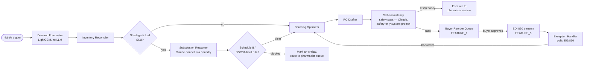

# RxForecast — Low-Level Design (LLD)

**Purpose:** `PRD.md` says *what* and *why*. `engg.md` says *what each feature does* (schema, routes, components). This document says *how it actually runs in production* — the services, the deployment topology, the agent-pipeline internals, the EDI wire mechanics, and the operational contracts an engineer needs to start building. Every decision here that isn't directly sourced from `PRD.md`/`engg.md` is flagged as a new judgment call, same convention as those two docs.

> **Full Azure migration (per user request, 2026-07-31).** Everything below runs on Azure — not the AWS stack `PRD.md` Appendix B originally priced. Interesting continuity note: `PRD.md`'s own Appendix B says the Cohort 9 PRD *template* was itself Azure-centric ("original template lists Azure-centric stack; our architecture runs on AWS + Anthropic. Mapped equivalents below.") — the team deliberately chose AWS over the template's default. This migration moves back to the template's original cloud assumption while keeping the deliberate Claude model choice, which is unaffected either way. **What this means for `PRD.md`:** Appendix B's operational cost table (~$8,200/mo, AWS-specific line items) is now stale and needs a re-pricing pass against Azure equivalents before it's trustworthy — §7.6 below gives the direct service-to-service mapping so that re-pricing is mechanical, but I'm not fabricating new dollar figures without checking Azure's current pricing pages.

---

## 1. System Architecture

```mermaid
flowchart TB
    subgraph CUSTVNET["Customer network (chain's environment)"]
        PMS["Pharmacy Mgmt System"]
        DEID["De-identification connector<br/>(RxForecast-supplied, runs in customer environment)"]
        PMS --> DEID
    end

    subgraph AZ["RxForecast Azure subscription — East US 2"]
        direction TB
        subgraph EDGE["Edge"]
            AFD["Azure Front Door<br/>(WAF + CDN + global LB)"]
            SWA["Static Web Apps<br/>(React SPA)"]
            ADMINSPA["Static Web Apps — Internal Admin Portal<br/>(FEATURE_9, separate app, admin.rxforecast.com)"]
        end
        subgraph CAENV["Container Apps Environment (VNet-integrated)"]
            API["Container App: api-service (FastAPI)"]
            ORCH["Container App: agent-orchestrator<br/>(Prefect worker + LangGraph)"]
            EDIIN["Container App: edi-ingestion-service"]
            EDIOUT["Container App: edi-transmission-service"]
            FCWORK["Container Apps Job: forecaster-worker<br/>(scheduled, not always-on)"]
        end
        subgraph DATA["Data subnet (private endpoints only)"]
            PG[("Azure Database for PostgreSQL<br/>Flexible Server, zone-redundant HA")]
            COSMOS[("Cosmos DB (NoSQL API):<br/>agent_run_state")]
        end
        SB1["Service Bus queue: edi-inbound"]
        SB2["Service Bus queue: shortage-alert"]
        SCHED["Container Apps Jobs — Schedule trigger<br/>(nightly cron, 4h FDA poll, daily ASHP poll)"]
        BLOB1[("Blob Storage: edi-raw<br/>(immutability policy, WORM)")]
        BLOB2[("Blob Storage: model-artifacts")]
        KV["Key Vault"]
        ACR["Container Registry"]
        FOUNDRY["Azure AI Foundry<br/>Claude via model catalog + Agent tracing"]
        ACS["Azure AI Content Safety<br/>(optional extra guardrail layer)"]
        SEARCH[("Azure AI Search — index per chain")]
        DOCINT["Azure AI Document Intelligence<br/>(bulletin OCR fallback)"]
    end

    subgraph EXT["External SaaS (cloud-agnostic, unchanged)"]
        VAN["Distributor VAN (AS2/SFTP)<br/>McKesson / Cardinal / ABC"]
        FDAX["FDA / ASHP feeds"]
        ENTRA["Microsoft Entra External ID<br/>(customer-IdP federation)"]
        ENTRAINT["Microsoft Entra ID — internal tenant<br/>(RxForecast employees only, separate from ENTRA)"]
        PREFECT["Prefect Cloud"]
        DD["Datadog"]
    end

    SWA --> AFD --> API
    ADMINSPA -->|Conditional Access:<br/>corporate network required| AFD
    API --> PG
    API --> ENTRA
    API -->|/api/admin/* only| ENTRAINT
    DEID -.->|PHI-stripped aggregates only| API
    SCHED --> ORCH
    PREFECT -.->|flow control| ORCH
    ORCH --> PG
    ORCH --> COSMOS
    ORCH --> FOUNDRY
    FOUNDRY -.-> ACS
    ORCH --> SEARCH
    ORCH --> BLOB2
    FDAX --> EDIIN
    EDIIN --> DOCINT
    VAN <--> EDIIN
    VAN <--> EDIOUT
    EDIIN --> SB1 --> ORCH
    EDIIN --> BLOB1
    EDIOUT --> BLOB1
    ORCH --> SB2
    EDIOUT --> PG
    API --> KV
    ORCH --> KV
    EDIIN --> KV
    EDIOUT --> KV
    API -.-> DD
    ORCH -.-> DD
```



**Assumption flagged:** region is `East US 2` (arbitrary, not PRD-specified) — pick based on where the first pilot chain's DCs concentrate; Azure's HIPAA-eligible services (covered under Microsoft's BAA) are available across regions, so this is a latency/cost choice, not a compliance one.

**Two active substitutions made for full-Azure consistency** (both override a tech choice `PRD.md` names explicitly — flagged, not silent):

| Was (PRD.md's named choice) | Now | Why |
|---|---|---|
| Pinecone | **Azure AI Search** | Single-vendor consistency; native grounding integration with Azure AI Foundry agents; still HIPAA-eligible under Azure's BAA, still supports hybrid (vector + keyword) search per the PRD's original rationale for Pinecone |
| Google Cloud Vision (bulletin OCR) | **Azure AI Document Intelligence** | Same reasoning — avoids a third cloud vendor for a small, swappable piece of the pipeline |

**Unchanged** (cloud-agnostic SaaS, no reason to touch): Prefect Cloud (orchestration), Datadog (observability), GitHub (source/CI).

**Changed but not a "consistency" call — genuine like-for-like Azure equivalents:** WorkOS → **Microsoft Entra External ID** for SSO federation (Entra External ID's CIAM tenant natively federates each pilot chain's own IdP — the same core capability WorkOS provided — and keeps identity inside the same Microsoft ecosystem as everything else). If Entra External ID's per-tenant federation setup proves heavier than WorkOS's for a 250-chain rollout, WorkOS remains a perfectly valid fallback — flagged in §12.

---

## 2. Service Inventory

| Service | Responsibility | Runtime | Scaling trigger |
|---|---|---|---|
| `api-service` | All REST routes from `engg.md` FEATURE_0–8; owns Postgres writes for buyer actions | Azure Container Apps, FastAPI, always-on (min 2 replicas for HA) | HTTP concurrency-based autoscale (KEDA, built into Container Apps) |
| `agent-orchestrator` | Runs the 9-component agent pipeline (§4 below) via Prefect + LangGraph | Azure Container Apps, always-on worker pool | Prefect concurrency limit; scales with # chains × # stores |
| `edi-ingestion-service` | Polls/receives 846, 855, 856, 869 from the VAN; parses X12; OCRs FDA PDF bulletins when text-extraction fails | Azure Container Apps, always-on | Service Bus queue-length scale rule (KEDA) |
| `edi-transmission-service` | Renders and sends 850s; handles 997 functional acks and 860 cancellations | Azure Container Apps, always-on | Request-driven, low volume |
| `forecaster-worker` | LightGBM training (monthly + drift-triggered) and nightly inference | **Container Apps Job** (scheduled trigger), not a persistent app | Cron schedule; parallel job executions per chain |
| React SPA | Buyer/director/PIC/compliance UI | Azure Static Web Apps | N/A (CDN-backed) |

**Why `forecaster-worker` is a Job, not an App:** it runs once nightly per chain plus on-demand retrains — an always-on replica would sit idle >23 hours/day. Container Apps Jobs bill only for execution time, which is the direct reason this doesn't need its own always-on cost line in the eventual re-priced ops budget.

---

## 3. Data Architecture

### 3.1 Multi-tenancy model

**New decision (not specified in PRD/engg.md):** shared Postgres instance, **logical multi-tenancy** via `chains.chain_id`, not schema-per-tenant or instance-per-tenant. Rationale: the PRD's operational cost model prices Pinecone/Prefect/Datadog (now Azure AI Search/Prefect/Datadog) as flat shared-infra line items, not per-chain — that only works if infrastructure is shared; per-tenant instances would break that unit economics. `chain_id` is threaded through:

- Directly on `formulary`, `distributor_contracts`, `chains`, `users` — chain-specific reference data
- Denormalized onto high-volume tables (`dispense_events`, `purchase_orders`, `audit_log`) for partition-pruning and query performance, even though it's technically derivable via `store_id → stores.chain_id`
- Enforced at the API layer by extending FEATURE_0's `enforceStoreScope()` to `enforceChainScope()` — every query is chain-scoped before it's store-scoped

If a large chain (>500 stores, per the PRD's enterprise pricing tier) later requires physical isolation for their own compliance sign-off, the schema-per-tenant migration path exists but isn't built for MVP.

### 3.2 Core DDL (Postgres 15, Azure Database for PostgreSQL Flexible Server)

Standard Postgres — nothing below is Azure-specific; Flexible Server is wire-compatible Postgres, so this DDL is unchanged from a generic Postgres deployment.

```sql
CREATE TABLE chains (
  chain_id           UUID PRIMARY KEY DEFAULT gen_random_uuid(),
  name                TEXT NOT NULL,
  sso_domain          TEXT UNIQUE,
  idp_type            TEXT CHECK (idp_type IN ('saml','oidc','none')) DEFAULT 'none',
  concurrent_session_limit INT DEFAULT 3,
  created_at          TIMESTAMPTZ NOT NULL DEFAULT now()
);

CREATE TABLE stores (
  store_id            UUID PRIMARY KEY DEFAULT gen_random_uuid(),
  chain_id            UUID NOT NULL REFERENCES chains(chain_id),
  store_name          TEXT NOT NULL,
  city TEXT, state TEXT,
  dc_assignment       TEXT,
  store_format        TEXT,
  open_date           DATE,
  sqft_tier           TEXT,
  pharmacist_in_charge_user_id UUID,
  deleted_at          TIMESTAMPTZ
);
CREATE INDEX idx_stores_chain ON stores(chain_id) WHERE deleted_at IS NULL;

CREATE TABLE users (
  user_id             UUID PRIMARY KEY DEFAULT gen_random_uuid(),
  chain_id            UUID NOT NULL REFERENCES chains(chain_id),
  name TEXT, email TEXT NOT NULL,
  role                TEXT NOT NULL CHECK (role IN ('buyer','director','pic','compliance','pharmacist')),
  store_id            UUID REFERENCES stores(store_id),
  auth_provider       TEXT NOT NULL CHECK (auth_provider IN ('sso','password')),
  external_idp_subject TEXT,
  mfa_enabled         BOOLEAN NOT NULL DEFAULT false,
  last_login_at       TIMESTAMPTZ,
  deactivated_at      TIMESTAMPTZ,
  UNIQUE (chain_id, email)
);
-- PIC must be store-scoped: enforced at app layer AND a DB check for defense-in-depth
ALTER TABLE users ADD CONSTRAINT pic_requires_store
  CHECK (role != 'pic' OR store_id IS NOT NULL);

CREATE TABLE auth_sessions (
  session_id   UUID PRIMARY KEY DEFAULT gen_random_uuid(),
  user_id      UUID NOT NULL REFERENCES users(user_id),
  issued_at    TIMESTAMPTZ NOT NULL DEFAULT now(),
  expires_at   TIMESTAMPTZ NOT NULL,
  revoked_at   TIMESTAMPTZ,
  ip_address   INET, user_agent TEXT
);
CREATE INDEX idx_sessions_user_active ON auth_sessions(user_id) WHERE revoked_at IS NULL;

CREATE TABLE idp_role_mappings (
  id                UUID PRIMARY KEY DEFAULT gen_random_uuid(),
  chain_id          UUID NOT NULL REFERENCES chains(chain_id),
  idp_group_name    TEXT NOT NULL,
  mapped_role       TEXT NOT NULL,
  mapped_store_id   UUID REFERENCES stores(store_id),
  UNIQUE (chain_id, idp_group_name)
);

CREATE TABLE formulary (
  ndc                     TEXT PRIMARY KEY,
  chain_id                UUID NOT NULL REFERENCES chains(chain_id),
  generic_name TEXT, brand_name TEXT,
  therapeutic_category    TEXT,
  dosage_form TEXT, strength TEXT, pack_size INT,
  dea_schedule             SMALLINT NOT NULL DEFAULT 0,
  orange_book_te_code      TEXT,
  manufacturer TEXT,
  velocity_tier             CHAR(1) CHECK (velocity_tier IN ('A','B','C')),
  is_glp1 BOOLEAN, is_insulin BOOLEAN,
  is_controlled_substance   BOOLEAN GENERATED ALWAYS AS (dea_schedule > 0) STORED,
  is_340b_eligible BOOLEAN,
  wac_price_per_pack NUMERIC(10,2), unit_cost_per_pack NUMERIC(10,2),
  deleted_at TIMESTAMPTZ
);
CREATE INDEX idx_formulary_chain ON formulary(chain_id) WHERE deleted_at IS NULL;

-- High-volume, RANGE-partitioned by month; partitions created 3 months ahead by a scheduled job
CREATE TABLE dispense_events (
  id                UUID DEFAULT gen_random_uuid(),
  chain_id          UUID NOT NULL,
  date              DATE NOT NULL,
  store_id          UUID NOT NULL REFERENCES stores(store_id),
  ndc               TEXT NOT NULL,
  quantity_dispensed NUMERIC(8,2), days_supply SMALLINT,
  payer_type TEXT, rx_fill_count SMALLINT,
  PRIMARY KEY (id, date)
) PARTITION BY RANGE (date);
CREATE INDEX idx_dispense_store_ndc_date ON dispense_events(store_id, ndc, date);

CREATE TABLE inventory_snapshots (
  id UUID PRIMARY KEY DEFAULT gen_random_uuid(),
  chain_id UUID NOT NULL, date DATE NOT NULL,
  store_id UUID NOT NULL REFERENCES stores(store_id), ndc TEXT NOT NULL,
  on_hand_qty NUMERIC(8,2), in_transit_qty NUMERIC(8,2),
  days_of_supply NUMERIC(6,2), reorder_point_days SMALLINT, target_days_of_supply SMALLINT,
  UNIQUE (store_id, ndc, date)
);

CREATE TABLE forecast_results (
  id UUID PRIMARY KEY DEFAULT gen_random_uuid(),
  run_date DATE NOT NULL, store_id UUID NOT NULL REFERENCES stores(store_id), ndc TEXT NOT NULL,
  forecast_qty_7d NUMERIC(8,2), confidence_low NUMERIC(8,2), confidence_high NUMERIC(8,2),
  mape_rolling_14d NUMERIC(5,2), model_version TEXT NOT NULL,
  UNIQUE (run_date, store_id, ndc)
);

CREATE TABLE shortage_events (
  shortage_id UUID PRIMARY KEY DEFAULT gen_random_uuid(),
  ndc TEXT NOT NULL, source TEXT NOT NULL,
  status TEXT CHECK (status IN ('current','resolved')),
  date_reported DATE, date_resolved DATE, reason TEXT, severity TEXT,
  bulletin_id TEXT, bulletin_text TEXT
);

CREATE TABLE substitution_events (
  substitution_id UUID PRIMARY KEY DEFAULT gen_random_uuid(),
  shortage_id UUID REFERENCES shortage_events(shortage_id),
  store_id UUID REFERENCES stores(store_id),
  original_ndc TEXT, proposed_alt_ndc TEXT,
  orange_book_te_match BOOLEAN,
  buyer_decision TEXT CHECK (buyer_decision IN ('pending','accepted','rejected','deferred')) DEFAULT 'pending',
  pharmacist_rated_appropriate BOOLEAN,
  rationale_text TEXT, created_at TIMESTAMPTZ DEFAULT now()
);

CREATE TABLE purchase_orders (
  po_id UUID PRIMARY KEY DEFAULT gen_random_uuid(),
  chain_id UUID NOT NULL, store_id UUID NOT NULL REFERENCES stores(store_id),
  distributor_id TEXT NOT NULL,
  status TEXT NOT NULL CHECK (status IN
    ('draft','pending_approval','approved','transmitted','acked','shipped','backordered','rejected','cancelled')),
  created_by_agent_run_id UUID, approved_by_user_id UUID REFERENCES users(user_id),
  approved_at TIMESTAMPTZ, edi_raw_blob_path TEXT, version INT NOT NULL DEFAULT 1
);
CREATE INDEX idx_po_chain_status ON purchase_orders(chain_id, status);

CREATE TABLE purchase_order_lines (
  id UUID PRIMARY KEY DEFAULT gen_random_uuid(),
  po_id UUID NOT NULL REFERENCES purchase_orders(po_id),
  ndc TEXT NOT NULL,
  quantity_ordered_agent NUMERIC(8,2), quantity_ordered_final NUMERIC(8,2),
  unit_price NUMERIC(10,2), contract_id UUID
);

CREATE TABLE po_acknowledgements (
  ack_id UUID PRIMARY KEY DEFAULT gen_random_uuid(),
  po_id UUID NOT NULL REFERENCES purchase_orders(po_id),
  ack_date TIMESTAMPTZ, line_status TEXT, quantity_confirmed NUMERIC(8,2),
  promised_ship_date DATE, edi_raw_blob_path TEXT
);

CREATE TABLE asn_shipments (
  asn_id UUID PRIMARY KEY DEFAULT gen_random_uuid(),
  po_id UUID NOT NULL REFERENCES purchase_orders(po_id),
  shipment_date DATE, delivery_date DATE, carrier TEXT,
  ndc TEXT, quantity_shipped NUMERIC(8,2), edi_raw_blob_path TEXT
);

CREATE TABLE buyer_overrides (
  override_id UUID PRIMARY KEY DEFAULT gen_random_uuid(),
  buyer_id UUID NOT NULL REFERENCES users(user_id),
  store_id UUID REFERENCES stores(store_id), ndc TEXT NOT NULL,
  override_type TEXT NOT NULL, rationale TEXT NOT NULL,
  created_date TIMESTAMPTZ DEFAULT now(), active BOOLEAN DEFAULT true
);

-- Append-only. See §3.3 for the permission model that makes this real, not just a comment.
CREATE TABLE audit_log (
  id UUID DEFAULT gen_random_uuid(),
  chain_id UUID NOT NULL,
  entity_type TEXT NOT NULL, entity_id UUID NOT NULL, action TEXT NOT NULL,
  actor_user_id UUID REFERENCES users(user_id), actor_agent_component TEXT,
  payload_json JSONB NOT NULL, sources_json JSONB,
  created_at TIMESTAMPTZ NOT NULL DEFAULT now()
) PARTITION BY RANGE (created_at);
```

**EDI envelope control numbers** (gap-fill — needed for valid X12, not in `engg.md`):

```sql
CREATE TABLE edi_control_numbers (
  distributor_id TEXT NOT NULL, chain_id UUID NOT NULL,
  transaction_set TEXT NOT NULL,     -- '850','855','856', etc.
  last_control_number BIGINT NOT NULL DEFAULT 0,
  PRIMARY KEY (distributor_id, chain_id, transaction_set)
);
-- Incremented via SELECT ... FOR UPDATE inside the transmit transaction — ISA/GS/ST
-- control numbers must never repeat or collide per distributor+chain, or the VAN rejects the envelope.
```

**Internal admin identity** (gap-fill, added 2026-07-31 — see §3.2.1 for why this is a second, isolated schema/identity boundary rather than a `role` value on the existing `users` table):

```sql
CREATE TABLE admin_users (
  admin_user_id UUID PRIMARY KEY DEFAULT gen_random_uuid(),
  name TEXT, email TEXT NOT NULL UNIQUE,
  mfa_enabled BOOLEAN NOT NULL DEFAULT true,   -- no opt-out, ever, for this table
  last_login_at TIMESTAMPTZ, deactivated_at TIMESTAMPTZ
);

-- Updated 2026-07-31: category taxonomy now matches the four groupings the product
-- is actually accountable for (business / ai_quality / user_trust / platform), plus
-- compliance and cost kept as their own categories given their launch-gate weight.
-- NOTE: 'platform' is NOT populated by the nightly job below — see §3.2.2. Storing
-- point-in-time system-health numbers in a daily-grained snapshot table would either
-- be stale (if written nightly) or bloat the table (if written every few minutes).
-- Platform metrics are fetched live from Datadog/Azure Monitor at request time instead.
CREATE TABLE metric_snapshots (
  id UUID PRIMARY KEY DEFAULT gen_random_uuid(),
  chain_id UUID REFERENCES chains(chain_id),   -- NULL row = portfolio-aggregate snapshot
  snapshot_date DATE NOT NULL,
  metric_category TEXT NOT NULL CHECK (metric_category IN ('business','ai_quality','user_trust','compliance','cost')),
  metric_name TEXT NOT NULL, metric_value NUMERIC, metadata_json JSONB,
  UNIQUE (chain_id, snapshot_date, metric_category, metric_name)
);

-- Reads, not just writes, are logged here — the sensitivity in this feature is WHO LOOKED AT WHAT,
-- distinct from audit_log's WHO CHANGED WHAT.
CREATE TABLE admin_dashboard_access_log (
  id UUID PRIMARY KEY DEFAULT gen_random_uuid(),
  admin_user_id UUID NOT NULL REFERENCES admin_users(admin_user_id),
  action TEXT NOT NULL,           -- 'portfolio_view','chain_drilldown','export', etc.
  chain_id UUID REFERENCES chains(chain_id),  -- NULL for portfolio-level actions
  created_at TIMESTAMPTZ NOT NULL DEFAULT now()
) PARTITION BY RANGE (created_at);
```

### 3.2.1 Why the admin identity is structurally isolated, not RBAC-only

Every role that reaches `users` (`buyer`, `director`, `pic`, `compliance`, `pharmacist`) is provisioned by a chain's own SSO federation (`idp_role_mappings`, `engg.md` FEATURE_0) — one misconfigured mapping row at *any* customer chain is scoped to that chain by construction. An RxForecast admin needs **cross-chain** visibility, which is categorically different: a mistake here isn't contained to one tenant. So the isolation is enforced at every layer, not just the database:

- **Separate identity provider:** `admin_users` accounts are provisioned through RxForecast's own internal Microsoft Entra ID tenant (employee directory), never through Entra External ID (the customer-facing federation service from §1). These are two different Azure AD tenants with no trust relationship between them.
- **Separate network path:** the admin dashboard's API routes require the request to originate from RxForecast's corporate network/VPN (Azure AD Conditional Access policy — location + device compliance), on top of authentication. A stolen admin credential alone is not sufficient without also being on the corporate network.
- **Separate token type:** `api-service`'s auth middleware checks that a request to `/api/admin/*` carries a token issued by the internal Entra ID tenant specifically — not "a token with an `admin` role claim," which would be checkable (and spoofable-in-theory) on the same token type every chain-scoped request uses. A chain-issued JWT cannot satisfy this check structurally, regardless of its claims.
- **MFA with no opt-out** (`admin_users.mfa_enabled` has no `false` path in the application logic, unlike `users.mfa_enabled` which is genuinely optional for buyer/PIC roles).
- **Reads are audited**, not just writes — `admin_dashboard_access_log` — because visibility itself is the sensitive operation here, not just mutation.

### 3.2.2 Metric taxonomy and the live-platform data path (added per user request, 2026-07-31)

FEATURE_9 tracks four things the product is accountable for, plus two operational categories. Five of six are historical/trend data (nightly `metric_snapshots`); the sixth (`platform`) is fetched live and deliberately kept out of that table.

| Category | Source | Cadence | Examples (full list: `PRD.md` §3, §8, §9) |
|---|---|---|---|
| `business` | Nightly snapshot, from `stockout_events`/`inventory_snapshots`/`purchase_orders` | Daily | North Star (Net OOS Hours/1K Rx), stockout rate reduction, working-capital reduction, buyer time saved, expiration write-off reduction, PO accuracy, savings-to-date |
| `ai_quality` | Nightly snapshot, from the offline eval harness (`PRD.md` §8) + HHH gate computation | Daily | Forecast MAPE/MAE/sMAPE, substitution appropriateness (pharmacist-rated), citation-grounding rate, confidence-calibration error, sourcing cost-optimal delta, model-routing split (Sonnet vs. Opus %), **HHH gate status** per stage (Measurement/Beta/Launch × Helpful/Honest/Harmless — folded in here rather than a separate top-level category, since it's fundamentally an AI-quality gate, not a distinct metric family) |
| `user_trust` | Nightly snapshot, from `substitution_events`/`purchase_order_lines`/`buyer_overrides` + survey data | Daily | Buyer accept rate, substitution acceptance rate, PO modification rate (a high rate means buyers don't trust the agent's numbers as-is), buyer override rate by SKU (>40% is itself a trust-erosion signal per `PRD.md`'s Fairness section), buyer NPS, explainability survey rating (≥4/5 target), **Why-panel engagement rate** (new metric, not named in `PRD.md` — % of recommendations where the buyer actually opened the explainability panel before acting; a low rate alongside a high accept rate is itself worth investigating, since it could mean rubber-stamping rather than informed trust) |
| `compliance` | Nightly snapshot, from `audit_log` counts + `an-critical` trigger events | Daily | DEA/340B/DSCSA incident count (target zero/quarter), P0/P1 incident count during beta, `an-critical` hard-block trigger count (expected non-zero — monitored for anomalous spikes, not absence) |
| `cost` | Nightly snapshot, from Azure billing export + Foundry token usage | Daily | Azure spend per chain vs. `PRD.md` Appendix B directional estimate, Foundry/Claude token cost per chain |
| **`platform`** | **Live pull from Datadog/Azure Monitor APIs at request time — not stored in `metric_snapshots`** | On page load, ~60–90s server-side cache | Current system status (healthy/degraded/incident), nightly batch success rate (last night's `agent-orchestrator` runs, % completed), EDI/VAN connectivity per distributor, active P0/P1 incident count, API uptime (rolling 30-day), real-time shortage-alert p95 latency vs. the <30s target |

**Why `platform` is architecturally different:** the other five categories are inherently daily/trend data — a stockout rate doesn't need second-by-second resolution, and forcing it into a live-fetch pattern would just add latency for no benefit. Platform health is the opposite: a stale "system status: healthy" reading during an actual incident is worse than useless. So `GET /api/admin/platform-status` calls Datadog's API (read-only scoped key, Key Vault-stored) directly, server-side, on every request, with a short cache to avoid hammering Datadog's rate limits — never persisted as a growing history table. This is explicitly a **summary**, not a Datadog replacement: `deployment.md` §4.1's dashboards remain the tool for actually debugging an incident; this panel exists so an admin doesn't need Datadog credentials just to answer "is everything okay right now."

### 3.3 Postgres role/permission model (the real mechanism behind "append-only")

```sql
CREATE ROLE rxforecast_app LOGIN;
GRANT SELECT, INSERT, UPDATE, DELETE ON ALL TABLES IN SCHEMA public TO rxforecast_app;
REVOKE UPDATE, DELETE ON audit_log FROM rxforecast_app;   -- INSERT + SELECT only
-- api-service, agent-orchestrator, edi-*-service all connect as rxforecast_app,
-- authenticated via Azure AD (Entra ID) Postgres integration — Flexible Server supports
-- Azure AD auth natively, so no long-lived DB password needs to live in Key Vault at all.
-- No role — including superuser day-to-day — has standing UPDATE/DELETE on audit_log;
-- a break-glass procedure (separate credential, itself audit-logged) is the only path.
```

### 3.4 Blob Storage layout

| Container | Contents | Notes |
|---|---|---|
| `edi-raw` | Every inbound/outbound X12 document | **Time-based retention immutability policy**, 7-yr, locked — the Azure Blob equivalent of S3 Object Lock compliance mode; matches the audit-log retention requirement, but for the raw wire format |
| `model-artifacts` | LightGBM model versions, per chain | Versioning enabled at the storage-account level; `forecaster-worker` reads/writes |
| `exports` | CSV/PDF exports (Feature 7/8) | 24-hr lifecycle-management rule auto-deletes — these are user-triggered, not retained records |

Path convention: `{container}/{chain_id}/{store_id}/{yyyy-mm-dd}/{doc_type}_{id}.edi` — chain-scoped prefixes double as the RBAC/SAS-token scoping boundary (see §7.4).

### 3.5 Cosmos DB — `agent_run_state`

Single container, NoSQL API, `partitionKey = /run_id`, `id = node_name`, TTL enabled (7 days) for automatic cleanup of completed runs — direct equivalent of the DynamoDB design from the AWS draft. This is LangGraph's checkpoint store, chosen over Postgres for this specific data because agent-run state is high-write, short-lived, and doesn't need relational joins; keeping it out of Postgres also keeps the database's connection pool clean during the nightly batch window when hundreds of store-runs execute concurrently.

### 3.6 Azure AI Search

One **index per chain** (same isolation principle `PRD.md` Appendix B stated for Pinecone — "isolation of namespaces per customer" — now expressed as Azure AI Search's per-index isolation). Two indexes per chain:

- `formulary-kb` — RxNorm, Orange Book, NDC Directory, GPO/340B contract sheets, chunked at ~500 tokens with section-header metadata; **hybrid search** (vector + BM25 keyword), matching the original Pinecone rationale exactly. Embedding model: Azure OpenAI `text-embedding-3-large` deployed inside the same Azure AI Foundry project — **new choice, not PRD-specified**, picked for being natively callable from the same Foundry project rather than a third embedding vendor.
- `shortage-kb` — FDA/ASHP bulletins, re-indexed on every 4-hour poll; older resolved-shortage bulletins retained for historical grounding but deprioritized in retrieval ranking by recency.

---

## 4. Agent Pipeline Internals

### 4.1 Orchestration model

Prefect Cloud schedules a **flow-per-chain**, triggered nightly via a Container Apps Jobs schedule → Prefect webhook, plus an **on-demand flow** for real-time shortage alerts (target <30s per PRD Model Requirements). Each chain's flow fans out to a LangGraph sub-run **per store**, executed with bounded concurrency (default 20 concurrent stores per chain) so a 300-store chain doesn't overwhelm the Foundry model-deployment's rate limit or the Postgres connection pool.

### 4.2 LangGraph state schema

```python
class StoreRunState(TypedDict):
    run_id: str
    chain_id: str
    store_id: str
    run_date: date
    forecast_results: list[ForecastLine]        # from Demand Forecaster
    inventory_snapshot: list[InventoryLine]      # from Inventory Reconciler
    active_shortages: list[ShortageMatch]        # from Shortage Watcher
    substitution_candidates: list[Substitution]  # from Substitution Reasoner
    sourcing_decision: SourcingResult | None
    po_draft: POdraft | None
    safety_pass_result: SafetyPassResult | None
    citations: list[Citation]                    # accumulated across every node — Explainability Layer
    status: Literal["running","awaiting_buyer","blocked_critical","complete","error"]
```

### 4.3 Node graph



Every node writes its output **and** its citation set into `StoreRunState.citations` before returning — this is how the Explainability Layer is implemented: not a separate graph node, but a wrapper (`@with_citations`) applied to every LLM-calling node, so citation-attachment can't be accidentally skipped by a future node addition.

**Model routing (per PRD Appendix B cost trade-off, still applicable):** a `route_model(task_complexity)` helper defaults every Claude call to a Sonnet deployment in Azure AI Foundry; the Substitution Reasoner escalates to an Opus deployment only when its own confidence self-report is below a threshold **or** the case involves >1 candidate substitute with conflicting TE codes — matching the PRD's stated "~5% of cases" escalation rate.

### 4.4 Idempotency & retries

Every node is idempotent on `(run_id, node_name)` — re-running a failed node overwrites its own Cosmos DB checkpoint rather than appending, so a Prefect retry never double-writes a PO. The PO Drafter node specifically checks for an existing `draft`/`pending_approval` PO for the same `(store_id, ndc, run_date)` before creating a new one.

### 4.5 Azure AI Foundry Integration

Since everything now runs in the same Azure subscription, this is simpler than a cross-cloud integration would have been:

- **Model client:** every LLM call in §4.2/§4.3 (Substitution Reasoner, Shortage Watcher's extraction, the self-consistency safety pass) targets a Claude deployment inside the RxForecast Azure AI Foundry project. LangChain/LangGraph's model-client abstraction (already the orchestration layer per the PRD's tech stack) makes this a configuration swap from a raw Anthropic model string to a Foundry deployment endpoint, not a rewrite of node logic.
- **Auth:** `agent-orchestrator`'s Container App has a **system-assigned Managed Identity** with RBAC access to the Foundry project — no API key or secret to store in Key Vault or rotate at all for this call path, which is a genuine simplification over the AWS-hybrid draft's cross-cloud service-principal approach.
- **Networking:** Foundry project configured with a **Private Endpoint** into the same VNet as the Container Apps Environment — the model call never touches the public internet, unlike the cross-cloud draft where that was an open question.
- **Tracing:** Foundry's built-in agent tracing (prompt, completion, token usage, latency per call) is captured alongside the existing `StoreRunState.citations` accumulation from §4.2 — not a replacement for it. The citations are what the buyer sees in the Explainability panel (`engg.md` Feature 3); Foundry's trace is an engineering-facing debugging/cost-audit layer on top, and now sits in the same Azure Monitor/Log Analytics workspace as everything else for correlated querying.
- **Optional extra guardrail:** Azure AI Content Safety screens model output before it reaches the self-consistency safety pass (§4.3 SAFE2 node) as a defense-in-depth layer. **Not a replacement** for the PRD's hardcoded clinical safety rules (no Schedule II auto-sub, etc.) — those remain deterministic code, not a content-safety classifier, because a probabilistic filter is the wrong tool for a rule that must never have exceptions.
- **What doesn't change:** the offline eval harness (`PRD.md` §8, §9 below) stays custom — Foundry's evaluation SDK ships generic groundedness/relevance evaluators, but RxForecast's actual eval targets (forecast MAPE, substitution appropriateness against the 200-case pharmacist-labeled set) are domain-specific and were never going to be off-the-shelf. The hard safety rules, `an-critical` UI treatment, and human-in-the-loop gates are all unchanged — none of that logic lives in "which cloud serves the model."

**Cost note:** `PRD.md` Appendix B priced Claude usage against Anthropic's direct API rates. Azure AI Foundry's Claude pricing may carry a small platform premium, may match it exactly, or may differ by deployment type (pay-as-you-go vs. provisioned throughput) — **this needs a confirmed number from Azure's current pricing page at build time**, not an assumed match.

### 4.6 Agentic vs. deterministic — stage by stage (added 2026-08-01)

A recurring question when explaining this pipeline to a non-engineering audience: which stages are genuinely "AI" and which are ordinary code that happens to sit in an AI pipeline. Answered explicitly, stage by stage, since §4.3's node graph only encodes this implicitly via which nodes call a Claude deployment:

| Stage | Agentic or deterministic | How (if deterministic) / why (if agentic) |
|---|---|---|
| Data Ingestion | Deterministic | Scheduled pull-and-normalize job. Same feeds in, same structured dataset out, every time. |
| 1 · Demand Forecaster | Deterministic (ML) | A trained forecasting model (LightGBM) applied to historical numbers. Same history → same forecast; no judgment call. |
| 2 · Shortage Watcher | **Agentic** | FDA/ASHP bulletins are free text, worded differently every time — extraction requires an LLM; a fixed rule set can't keep up with the phrasing (this is the PRD's own "Why Agentic AI?" argument, reason 1). |
| 3 · Inventory Reconciler | Deterministic | Arithmetic: forecast minus on-hand minus in-transit, checked against the reorder-point threshold. |
| 4 · Substitution Reasoner | **Agentic** | Weighs several independent, sometimes conflicting factors at once (TE match, payer coverage, 340B eligibility, contract availability) — a combinatorial judgment call the PRD explicitly argues rules can't enumerate (reason 2). The DEA Schedule II hard-block *inside* this stage is the one part that's always deterministic regardless — see §4.5's safety-rule note above; that logic is never delegated to the model. |
| 5 · Sourcing Optimizer | Deterministic | Cost/lead-time/allocation comparison across a known, finite distributor list — picks whichever satisfies constraints at lowest cost. |
| 6 · PO Drafter | Deterministic | Assembles the order and runs the 2-sigma statistical check against trailing 30-day order history — templating and arithmetic. |
| Buyer Review (human gate) | Neither — human decision | Not an agent. A person approves, edits, bulk-approves, or rejects; deliberately never automated. |
| 7 · EDI Transmission | Deterministic | Formats the approved order into the X12 850 segment structure, assigns the next control number — a protocol/templating task. |
| 8 · Exception Handler | Deterministic | Fixed state machine keyed on the 855 status code (accepted/backordered/partial); routes to a replan only on the backorder branch. |
| Explainability Layer | Deterministic | A wrapper (`@with_citations`, §4.3) that mechanically attaches whatever citation each stage already produced — it generates no judgment of its own. |

Net: **2 of the 11 stages are genuinely agentic**; the other 9 are ordinary deterministic code that happens to run inside an agent pipeline. This isn't a shortcut — it's the PRD's own design principle (§1 "Why Agentic AI?"): reach for a model only where the task structurally requires it (unstructured extraction, multi-factor combinatorial reasoning), and use cheaper, faster, more predictable deterministic logic everywhere else. It's also why a probabilistic model is never in the path of the one rule that must never have exceptions (Schedule II).

---

## 5. EDI Integration Layer

### 5.1 Inbound (846, 855, 856, 869)

`edi-ingestion-service` connects to each distributor's VAN over **AS2** (primary) with an **SFTP** fallback where a distributor doesn't support AS2 — abstracted behind a `VanConnector` interface so a distributor/VAN change doesn't ripple into parsing or business logic:

```
VanConnector (interface)
 ├── AS2Connector    — MDN-acknowledged, used for McKesson, Cardinal
 └── SftpConnector   — poll-based, used where AS2 isn't offered
```

Parsing via the `edi-x12` library (per PRD tech stack) into typed line-item objects; malformed segments go to a dead-letter path (`blob://edi-raw/.../dead-letter/`) with a Datadog alert — never silently dropped, per the PRD's "no silent failures" reliability constraint.

**FDA/ASHP bulletin parsing:** text-extraction first; if the source is a scanned/image PDF (fails a 100-word-minimum heuristic, same pattern used elsewhere for "insufficient data" detection), fall back to **Azure AI Document Intelligence** (§1 substitution table) rather than a second cloud vendor's OCR service.

### 5.2 Outbound (850, plus 997/860)

Extends `engg.md` FEATURE_5 with the wire-level mechanics it deliberately left out:

- Control numbers (`ISA13`, `GS06`, `ST02`) pulled from `edi_control_numbers` inside the same transaction as the PO status update — prevents the collision risk of two concurrent transmit jobs grabbing the same number.
- **997 functional acknowledgement** (flagged as a gap in `plan.md` §7.1) is now handled: `edi-ingestion-service` treats a missing 997 within 4 hours of transmission as a transport-layer failure distinct from a business-level rejection, and flags the PO `transmitted_unconfirmed` — this is what closes the "silent failure looks identical to buyer forgot to order" gap identified earlier.
- **860 cancellation**: triggered by Feature 5's transmit-failure/idempotency path per `engg.md`; also manually triggerable by compliance for the Tier-3 incident-recovery flow in `PRD.md` §9.

---

## 6. API Conventions

- **Auth:** every request carries a Bearer JWT (FEATURE_0, now issued after Entra External ID federation); `chain_id` and `role` are claims in the token, never trusted from a request body/query param.
- **Pagination:** cursor-based (`?cursor=...&limit=50`) on every list endpoint touching high-volume tables (`dispense_events`-derived views, `audit_log`); offset pagination is explicitly disallowed on those two for performance reasons.
- **Idempotency:** all mutating endpoints (`POST /api/pos/{id}/approve`, `/transmit`, etc.) require an `Idempotency-Key` header; the API layer stores a short-lived (24h) key→response cache in Cosmos DB (separate container from `agent_run_state`) to make client retries safe. **Bulk operations** (`POST /api/pos/bulk`, added 2026-08-01 in the demo prototype without the idempotency-key layer — see `execution.md`) follow the same rule at production scope: the endpoint accepts an array of items and must be idempotent *per item*, not just per request, since a client retry after a partial-network-failure response needs re-submitting the same batch to be safe — an item that already resulted in an approved PO should be a no-op on retry, not a duplicate PO. The response uses HTTP 207 Multi-Status with a per-item `{ok, ...}` result so a partially-successful batch is representable without an all-or-nothing 200/500.
- **Errors:** RFC 7807 `application/problem+json` — `{ type, title, status, detail, instance }` — chosen so the "say what happened and what to do" copy rule from `design-system.md` has a consistent field (`detail`) to render from, not a bespoke error shape per endpoint.
- **Versioning:** `/api/v1/...` path prefix from day one; no unversioned routes, since a multi-year EDI-adjacent system will need to evolve contracts without breaking the pilot chain's integration.

---

## 7. Deployment & Infrastructure

### 7.1 IaC

Terraform (`azurerm` provider), one module per bounded context: `modules/networking`, `modules/postgres`, `modules/container-apps`, `modules/cosmos`, `modules/storage`, `modules/keyvault`, `modules/ai-foundry`. Bicep is the Azure-native alternative if the team prefers staying inside a single-vendor IaC toolchain — flagged as an open choice in §12, not decided here. Environments (`dev`, `staging`, `prod`) are separate **Azure subscriptions**, not just resource groups — subscription-level isolation matters given the HIPAA/PHI-adjacent surface, even though PHI itself never enters these subscriptions (§7.5).

### 7.2 CI/CD

- GitHub Actions → build → test (unit + the offline eval harness from `PRD.md` §8, run as a required check) → push to Azure Container Registry → deploy to `staging` automatically, `prod` on manual approval.
- Database migrations via Alembic, run as a one-off Container Apps Job **before** the new API revision goes live — never auto-applied by the app process on boot.
- Container Apps' **native revision-based traffic splitting** handles blue/green for `api-service` (shift traffic 0%→100% to the new revision after health checks pass, instant rollback by shifting back); `agent-orchestrator` and the EDI services use a drain-then-replace rollout, since mid-flight LangGraph runs must finish on the old revision before it's deallocated.

### 7.3 Environments

| Env | Purpose | Data |
|---|---|---|
| `dev` | Engineer sandboxes | The synthetic dataset (`RxForecast_SyntheticData/`) — already built, 24 months, 12 stores, 208 NDCs |
| `staging` | Pre-prod, mirrors prod topology at smaller scale | Synthetic data at larger scale (re-run `generate.js` at the PRD's full 200-store/8K-SKU target) |
| `prod` | Live pilot chain(s) | Real chain data, full compliance controls active |

### 7.4 Network & tenant isolation

- Each chain's Blob objects live under a `{chain_id}/` prefix; RBAC role assignments on the Container Apps' Managed Identities are scoped with storage **ABAC conditions** on that prefix, so a bug in one chain's processing path cannot physically read another chain's raw EDI documents, independent of the application-layer `chain_id` check in §3.1.
- Postgres Flexible Server: zone-redundant HA, deployed with **VNet integration** (no public endpoint); only the Container Apps Environment's subnet can reach it.
- No direct database access from any human — all access is via the API or a break-glass bastion (Azure Bastion) with its own audit trail.

### 7.5 PHI boundary — how "PHI never enters the LLM context" is actually enforced

The PRD states this as a principle; here's the mechanism: the **De-identification connector** (see architecture diagram, §1) is a small RxForecast-supplied service that runs **inside the customer's own environment** (via Azure VNet peering / ExpressRoute if the chain is Azure-hosted, or a customer-hosted container otherwise, depending on the chain's IT posture), reads the PMS's dispense feed, strips everything except `(NDC, store_id, date, quantity)`, and is the *only* thing that calls out to the RxForecast Azure subscription. Patient-identified data physically never crosses the boundary — it's not a filter applied after ingestion, it's a component that never has network access to anything that could receive identified data downstream. This is what the PRD's "federated query interface" line actually resolves to at the implementation level.

### 7.6 AWS → Azure service mapping (for re-pricing PRD.md Appendix B)

| Was (AWS, PRD.md Appendix B) | Now (Azure) |
|---|---|
| ECS Fargate | Azure Container Apps |
| ALB + CloudFront | Azure Front Door |
| S3 (static SPA hosting) | Azure Static Web Apps |
| RDS Postgres Multi-AZ | Azure Database for PostgreSQL Flexible Server (zone-redundant) |
| DynamoDB | Cosmos DB (NoSQL API) |
| S3 (documents/artifacts) | Blob Storage |
| SQS | Service Bus |
| EventBridge Scheduler | Container Apps Jobs (Schedule trigger) |
| Secrets Manager | Key Vault |
| ECR | Container Registry (ACR) |
| VPC / security groups | Virtual Network (VNet) / Network Security Groups |
| IAM roles | Azure RBAC + Managed Identity |
| Pinecone | Azure AI Search *(active substitution, §1)* |
| Google Cloud Vision | Azure AI Document Intelligence *(active substitution, §1)* |
| WorkOS | Microsoft Entra External ID *(§1, flagged fallback in §12)* |
| Prefect Cloud, Datadog, GitHub | **Unchanged** — cloud-agnostic SaaS |

---

## 8. Observability

| Signal | Tool | Key metrics | Alert threshold |
|---|---|---|---|
| APM / traces | Datadog (Azure integration) + Azure Monitor/Application Insights for platform-level signals | p50/p95/p99 per route, LangGraph node duration, Foundry call latency | p95 API latency > 2s (5 min sustained) |
| Logs | Datadog, fed from Container Apps' native Log Analytics integration | Structured JSON, `chain_id`/`run_id`/`request_id` on every line | EDI parse failure rate > 1% (15 min window) |
| Business metrics | Datadog dashboards, fed by a nightly export job | Forecast MAPE rolling 14-day, buyer accept rate, substitution acceptance rate — mirrors `PRD.md` §8 Monitoring | MAPE > 20% → auto-file a P2; buyer accept < 65% → P2; any `an-critical` bypass attempt → **P0, page on-call immediately** |
| Uptime | Datadog Synthetics + status page | `/health` on each Container App | Two consecutive failed checks |

Incident tiers map directly to `PRD.md` §9's Tier 1/2/3 recovery plan — alert routing is configured to open the corresponding tier's runbook, not a generic ticket.

**This table is engineering telemetry, not the whole picture.** Datadog is for engineers diagnosing system health (latency, errors, infra). It is a *different surface* from FEATURE_9 (`engg.md`), the in-product Admin Metrics Dashboard that shows RxForecast leadership/ops/the compliance review board the actual `PRD.md` §3/§8/§9-defined success metrics (North Star, eval results, HHH gate status) without needing Datadog access at all. Neither replaces the other — Datadog answers "is the system healthy," FEATURE_9 answers "is the product working, per the metrics we said we'd be judged on."

---

## 9. Testing Strategy

| Layer | Tooling | What it covers |
|---|---|---|
| Unit | pytest (backend), Vitest (frontend) | Helper functions named throughout `engg.md` (`computePriorityScore`, `validateQuantityBand`, etc.) |
| Integration | pytest + testcontainers (real Postgres, Cosmos DB Emulator) | Every "Testing Checklist" item in `engg.md` that says "integration test" |
| Contract | Schemathesis against the OpenAPI spec generated by FastAPI | Every API route's request/response shape stays honest |
| EDI round-trip | Custom harness against `raw_edi_samples/*.edi` from the synthetic dataset | 850 generation validates through a real X12 parser; 855/856 parsing round-trips against known-good fixtures |
| Agent eval | The offline eval harness from `PRD.md` §8, run in CI on every `agent-orchestrator` change | Forecast MAPE, substitution appropriateness (against the 200-case set), citation-grounding rate |
| E2E | Playwright against `staging` | Full user flows per `engg.md` (login → queue → approve → EDI transmit → status stepper) |
| Load | k6 | 100 concurrent store-runs (nightly batch profile) against `staging`'s scaled synthetic data |

The synthetic dataset already built (`RxForecast_SyntheticData/`) is the fixture source for integration/EDI/load tests — no need to generate a second test dataset from scratch.

---

## 10. Non-Functional Requirements → Concrete SLOs

| Requirement (from PRD.md §5 Constraints / Model Requirements) | Concrete SLO |
|---|---|
| Real-time shortage alerts <30 sec | p95 end-to-end from FDA poll to `shortage_events` row visible in API: 25s (5s margin) |
| Daily batch, latency-tolerant | Nightly run window: 11pm–5am chain-local; hard deadline 6am so the buyer's morning queue is always fresh |
| 200K+ token context | Enforced at the prompt-assembly layer — a context-budget check truncates least-recent buyer-override examples first, never truncates safety constraints or the current shortage/formulary data |
| Zero DEA/340B/DSCSA incidents | `an-critical` hard-blocks are enforced **server-side only** (§4.3 SAFE1/SAFE2 nodes) — the UI hiding a button is a UX nicety, never the actual control |
| 99.5%+ uptime (inferred from PRD's SOC 2/reliability posture) | Zone-redundant Postgres, ≥2 replicas per always-on Container App, health-check-gated Front Door routing |
| 7-year audit retention | Blob immutability policy (locked, time-based retention) + Postgres partition-per-year on `audit_log`, oldest partitions moved to Azure Archive tier, never deleted |

---

## 11. Rollout Plan (Pilot Chain Onboarding)

1. **Data migration:** chain provides 24 months of historical dispense/PO/855/856 data (per `PRD.md` §8 Ground Truth Setup) → loaded via a one-time ETL job into `dispense_events`/`purchase_orders` partitions, backfilling `forecaster-worker`'s training set.
2. **VAN cutover:** `edi-ingestion-service` connects to the chain's existing McKesson AS2 endpoint in **read-only shadow mode** first — parses and stores inbound EDI without any outbound transmission capability enabled.
3. **Measurement launch** (`PRD.md` §9): 1 store, 2 weeks, shadow mode — `agent-orchestrator` runs nightly, `purchase_orders` never leaves `draft` status.
4. **Beta launch:** 10–20 stores, `edi-transmission-service` enabled, buyer approval gate live.
5. **Launch:** 60+ stores, full feature set, autonomous-PO path still gated off (Iteration phase per `PRD.md` §4).

---

## 12. Open Engineering Decisions

Flagged here rather than silently decided, since they affect cost/timeline and should be confirmed before build starts:

1. **AS2 library/vendor** — build vs. buy (e.g., a managed AS2 gateway) for the VAN connector; raw AS2 (MDN handling, encryption/signing) is nontrivial to implement correctly in-house, and this is unaffected by the Azure move.
2. **Per-chain Key Vault-managed keys** — MVP uses one application-wide CMK; confirm whether any pilot chain's compliance team requires per-tenant keys before Launch.
3. **Embedding model for Azure AI Search** — Azure OpenAI `text-embedding-3-large` assumed above; confirm this is still the right call vs. a Voyage AI or other embedding model once Azure AI Search's current model-compatibility list is checked at build time.
4. **Entra External ID vs. WorkOS** — Entra External ID is the full-Azure-consistency choice, but its per-tenant external-IdP federation setup should be piloted against 2–3 real chain IdPs (Okta, Azure AD, Google Workspace) before committing; if the CIAM configuration proves heavier than expected at 250-chain scale, WorkOS remains a valid fallback that doesn't block anything else in this document.
5. **Terraform vs. Bicep** — `azurerm` Terraform assumed for consistency with how this doc is written, but an all-Azure shop may prefer Bicep as the native IaC tool; either works with everything else specified here.
6. **De-identification connector deployment model** — VNet peering/ExpressRoute vs. a customer-hosted container depends entirely on each pilot chain's IT posture (and whether they're Azure-hosted themselves); this needs a per-chain technical discovery call, not a single fixed answer.
7. **PRD.md Appendix B re-pricing** — §7.6's service mapping is directional; actual Azure costs need to be pulled from the Azure Pricing Calculator before that appendix can be updated with confidence, especially the Foundry/Claude line item (§4.5's cost note).
