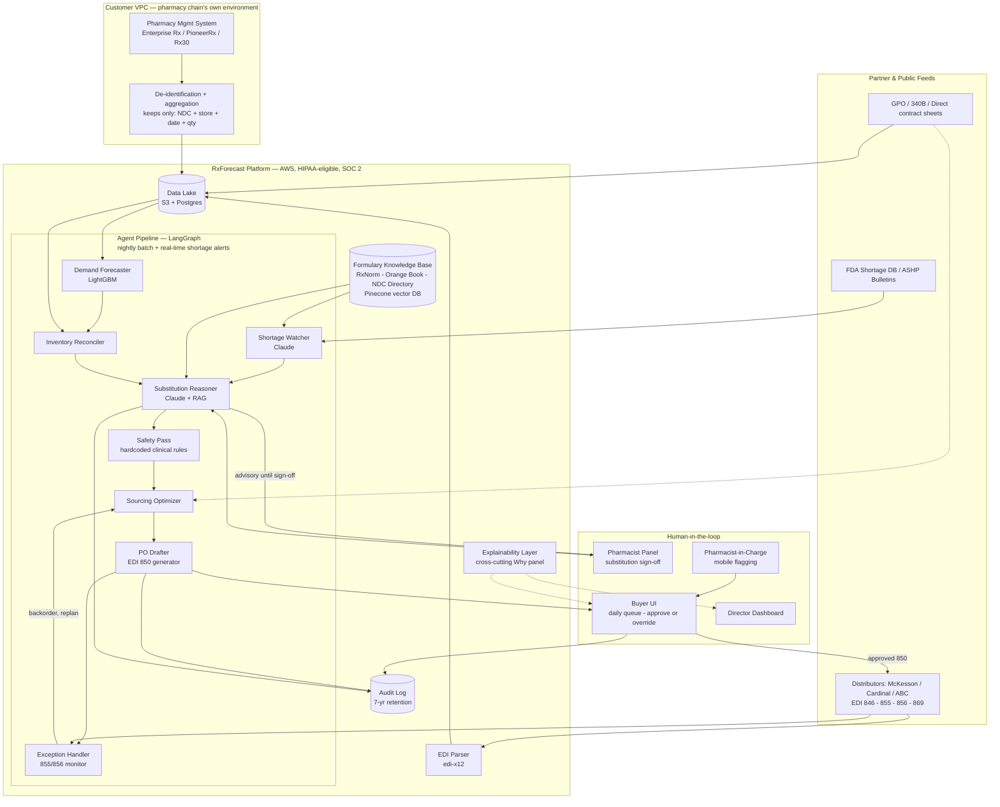

# RxForecast — Build Plan & Data Requirements

**Predictive EDI Ordering Agent for Mid-Market Pharmacy Chains**
Cohort 9 — PRD for AI Products (Weeks 1–5, treated as one PRD)

> Companion artifact (same content, visual/interactive): https://claude.ai/code/artifact/0085d8bc-72d4-4fa8-ad90-c81b39d9407f
> Source PRDs: `PRD_ForecastRx.docx` (Wk1), `Week2_PRD.docx` (Wk2), `RxForecast_Week3_PRD.docx` (Wk3), `PRD_Week4_RxForecast.docx` (Wk4), `PRD_Week5_RxForecast.docx` (Wk5) — all in `AIPMCourse/`.
> Synthetic data: `AIPMCourse/RxForecast_SyntheticData/`

---

## 1. PRD Snapshot — what's already strong

| | |
|---|---|
| **Job to be done** | Right drug, right store, right time — without stockouts, write-offs, or compliance exposure. |
| **North Star metric** | Net Out-of-Stock Hours per 1,000 Rx dispensed (lower is better). |
| **Highest-risk component** | Substitution Reasoner — clinical-safety exposure; advisory-only until pharmacist-panel sign-off in Beta. |
| **Model split** | LightGBM for demand forecasting (well-solved, cheap, auditable). Claude Sonnet/Opus for reasoning (shortage parsing, substitution, sourcing). |
| **MVP proof point** | 20% stockout reduction on top-200 SKUs, at one ~150-store pilot chain, within 90 days. |
| **Unit economics** | ~$8.2K/mo run cost per chain vs. $350–600/store/mo pricing → ~72% gross margin at 150 stores. |
| **Autonomy posture** | Human-in-the-loop through Launch. Autonomous PO only for whitelisted low-risk, non-controlled, high-confidence SKUs — Iteration phase only. |

---

## 2. Scope Note — target market

**Resolved 2026-07-30: kept as written in the PRD.** The PRD explicitly excludes Costco and the rest of the top 5 (CVS, Walgreens, Walmart, Kroger) — they run internal data-science teams, and selling to them is a 24-month enterprise sales grind that doesn't fit a 6-month-to-MVP plan. The target stays the ~250 mid-market chains (50–300 stores: HEB, Wegmans, Thrifty White, Discount Drug Mart-scale) with a ~$60B combined annual procurement spend.

"Costco" is used only as a *persona reference* for the synthetic data and demo — a large-format, high-generic-velocity, club-style pharmacy operating profile — without adopting Costco's actual enterprise scale, procurement team, or sales cycle.

---

## 3. Constraints

The PRD doesn't have these consolidated in one place — each was stated once, in whichever section it happened to come up. Gathered here so they're not missed on a skim.

**Scope constraints**
- Excludes the top-5 national chains (CVS, Walgreens, Walmart, Costco, Kroger) — internal DS teams, 24-month sales cycle
- Excludes independent pharmacies (<10 stores) — different price point, lighter compliance, later phase
- Excludes compounding/503B and specialty pharmacy (oncology, ophthalmic, biologics) — sparse data, heterogeneous patient mix, not designed for it
- Not a clinical decision tool — explicitly out-of-scope: dispensing decisions, patient counseling, prescriber recommendations
- No Schedule II auto-ordering in V1/Beta/Launch — Schedule II requires DEA Form 222 / CSOS, deferred to Iteration under a separate compliance track

**Regulatory constraints**
- HIPAA — BAA executed per customer; PHI never enters the LLM context window; minimum-necessary principle
- DSCSA — drug supply-chain traceability
- DEA — controlled-substance schedules gate what can ever be auto-substituted or auto-ordered
- 340B — ceiling pricing rules; hard rule against 340B/non-340B inventory commingling
- State pharmacy board substitution law — varies by state, not federally uniform

**Technical constraints**
- Context window: 200K+ tokens required (full chain formulary + shortage notices + override history + contract terms must fit in one call)
- Latency: medium priority — daily batch dominates; real-time path reserved only for shortage alerts (<30 sec target)
- No LLM fine-tuning in V1 — prompting + RAG only, for faster iteration and easier compliance review; fine-tuning deferred to V2 (style/functional output only, not new clinical knowledge)
- Hybrid model architecture is fixed: LightGBM for forecasting, Claude for reasoning — not a single-model system

**Resource & timeline constraints**
- 6-month MVP timeline (pilot signed month 1, forecast online month 4, buyer UI in production month 6, beta month 7)
- ~$675K one-time MVP build cost (core engineering $355K + ML/PharmD/PM/Design/Compliance $320K)
- ~$8.2K/mo steady-state run cost per chain — pricing and margin math depend on staying near this
- Fixed team roster for MVP: 1 DevOps/Platform, 2 Backend, 1 Frontend, plus ML Eng, PharmD SME, PM, Design, Compliance lead

---

## 4. Execution Plan

The PRD's four releases, turned into buildable phases.

### MVP — Prove the forecast (12 weeks, shadow mode)

**Build**
- Data ingestion: EDI 846 from McKesson, dispense feed from PMS
- Demand Forecaster (LightGBM) live on top 200 SKUs
- Shortage Watcher — FDA + ASHP feeds, LLM extraction
- Buyer UI v1 — daily queue + explainability panel
- HIPAA-grade infra baseline; PHI never enters LLM context

**Exit gate:** Forecast MAPE ≤20% on top-200 SKUs · 100% citation coverage · zero autonomous actions, all output read-only.

**Team:** 1 DevOps/Platform, 2 Backend, 1 Frontend (core $355K per PRD) + ML Eng, PharmD SME, PM, Design, Compliance lead.

### MVP 1 — Add reasoning (12 weeks, 10–20 store beta)

**Build**
- Expand forecaster to top 2,000 SKUs
- Substitution Reasoner (advisory-only), pharmacist-panel calibration
- Add Cardinal Health as second distributor; Sourcing Optimizer v1
- Explainability v2 — source-document deep-links
- Director-level weekly dashboard

**Exit gate:** Stockout ↓10% vs. baseline · buyer accept rate >70% · <0.5% clinically-inappropriate substitutions flagged.

### Launch — Close the loop (12 weeks, 60+ stores)

**Build**
- One-click EDI 850 generation + VAN/clearinghouse transmission
- Exception Handler — 855/856 monitor with automatic replan on backorder
- 340B-aware sourcing; expiration optimization (route short-dated stock to high-velocity stores)
- Buyer override learning closed loop; SOC 2 Type 2

**Exit gate:** 20% stockout reduction · 15% working-capital reduction · zero DEA/340B events · buyer NPS >40.

### Iteration — Widen the moat (6-month cadence, ongoing)

**Build**
- Controlled-substance ordering (Sch. III–V; Sch. II via CSOS)
- Multi-chain rollout with shared shortage intelligence
- GPO partnership integrations (Premier, Vizient, HealthTrust)
- Autonomous PO for whitelisted low-risk SKUs, tight guardrails

**Exit gate:** Quarterly compliance board sign-off per autonomous SKU class added.

---

## 5. How It Gets Built — In Plain Terms

1. **Keep the data at home.** The pharmacy chain's dispensing system never sends us patient data. It strips out anything patient-identifying and only sends "this drug, this store, this date, this quantity." That stripped-down summary is the only thing that leaves their walls.
2. **Watch three things nightly.** What did each store sell recently (predicts what they'll need next), what does the distributor say is in stock, and has anything gone into a national shortage.
3. **Two different "brains" for two different jobs.** Predicting *how much* of a drug a store will need next week is a numbers problem — a lightweight statistical model (LightGBM) is fast, cheap, and auditable for that. Deciding *what to do* about a shortage or which distributor to buy from is a reasoning problem — that's where Claude comes in, because it can read a messy FDA bulletin, cross-check a drug's legal substitute options, and explain its reasoning in plain English.
4. **Nothing ships without a human.** The agent never places an order on its own in the early phases. It builds a ranked to-do list — "these 40 drugs need reordering, here's why, here's what I'd substitute if X is short" — and a human buyer clicks approve, edit, or skip. Every recommendation shows its sources.
5. **Speak the distributor's language.** Once approved, the system writes the order in EDI X12 format — the structured-text format wholesalers' computers already expect — and sends it through the same electronic pipe (a VAN/clearinghouse) the pharmacy already uses.
6. **Watch what happens next.** The distributor sends back a confirmation (sometimes "backordered"), then a shipping notice. If an order gets backordered, the system automatically re-plans instead of leaving the store short.

---

## 6. System Architecture

Four zones: the customer's own systems (patient data never leaves), the outside world feeding it data, the platform doing the thinking, and the humans who stay in the loop.

Read it as: data flows in from the left (customer VPC + partner feeds), gets reasoned over in the platform's agent pipeline in the middle, and nothing reaches the distributor on the right without passing through the human-in-the-loop box first. The dotted lines are the explainability layer attaching a "why" to everything the humans see.

---

## 7. Data Point Catalog

Legend: **[in PRD]** already named in the Week 1–5 document · **[gap-fill]** implied by the architecture, worth specifying now · **[P0/compliance]** required before any autonomous action.

### 7.1 Transactional EDI documents

| Data point | Format / source | Feeds | |
|---|---|---|---|
| Purchase orders (850) | X12 850, generated by PO Drafter | Sourcing Optimizer → distributor | in PRD |
| PO acknowledgements (855) | X12 855 from distributor | Exception Handler | in PRD |
| Advance ship notices (856) | X12 856 from distributor | Inventory Reconciler, delivery tracking | in PRD |
| Inventory advice (846) | X12 846, polled from McKesson/Cardinal | Inventory Reconciler | in PRD |
| Allocation notices (869) | X12 869 / email | Shortage Watcher | in PRD |
| PO cancellations (860) | X12 860 | Tier-3 incident recovery (named in Responsible AI section, not in main pipeline) | gap-fill |
| Invoice / remittance (810/820) | X12 810/820 | Contract price reconciliation — "weekly reconciliation against distributor invoices" is named as a mitigation but the feed itself isn't specified | gap-fill |
| Functional acknowledgement (997) | X12 997 | EDI transport-layer confirmation that a sent 850 was even received — silent failures here look identical to "buyer forgot to order" | gap-fill |

### 7.2 Demand & dispense signals

| Data point | Format / source | Feeds | |
|---|---|---|---|
| Dispense history (SKU-store-day) | NCPDP 837 aggregates, PHI-stripped | Demand Forecaster | in PRD |
| Payer mix per fill | Derived from 837 | 340B eligibility logic, margin-suppressed context | in PRD |
| Days-supply per fill | Derived from 837 | Reorder-point timing | in PRD |
| Store open/close events, holiday calendar | Chain ops calendar | Forecaster cleaning step (source not specified in PRD) | gap-fill |
| New-SKU launch flags & cold-start markers | NDC directory sync (weekly) | Confidence-banded fallback to par levels | in PRD |
| Local/regional demand shocks (flu surveillance, weather) | External feed — not named in PRD | The "demand shock" half of the problem statement has no wired source to catch it early | gap-fill |

### 7.3 Inventory & sourcing

| Data point | Format / source | Feeds | |
|---|---|---|---|
| On-hand + in-transit inventory | PMS + EDI 846 | Inventory Reconciler | in PRD |
| Open PO status | Internal PO log + 855 | Reorder suppression (don't double-order) | in PRD |
| Distributor lead time, by SKU class | Historical 850→856 deltas | Sourcing Optimizer | gap-fill |
| Lot number & expiration date per unit | 856 line detail / receiving scan | Expiration optimization (Launch phase) needs lot-level granularity the PRD's SKU-store-day grain doesn't carry | gap-fill |
| Stockout events (<2 units on-hand, >4hrs, open hours) | Derived from inventory feed | North Star metric numerator | in PRD |

### 7.4 Drug & formulary reference (knowledge base)

| Data point | Format / source | Feeds | |
|---|---|---|---|
| FDA NDC Directory (~150K active NDCs) | RAG-served, structured | NDC normalization | in PRD |
| Orange Book therapeutic equivalence codes (~17K) | RAG-served, structured | Substitution Reasoner grounding | in PRD |
| RxNorm concept graph (~120K) | RAG-served, structured | Drug-name normalization across systems | in PRD |
| DEA controlled-substance schedules | Structured reference | No Schedule II auto-sub | P0/compliance |
| State pharmacy board substitution law variance | Structured, per-state — not fully specified | Substitution legality varies by state; flagged as a regulatory exposure with no operational data source named | gap-fill |
| USP <797>/<800> compounding flags | Advisory reference | Excludes compounding/503B from scope | in PRD |
| Chain formulary + tier status | Customer-provided, 8K–15K NDCs | Bounds what the agent is even allowed to recommend | in PRD |

### 7.5 Shortage & allocation intelligence

| Data point | Format / source | Feeds | |
|---|---|---|---|
| FDA Drug Shortage List | Unstructured, polled every 4hrs | Shortage Watcher | in PRD |
| ASHP Drug Shortages bulletins | Free text, polled daily | Shortage Watcher (dual-source cross-check) | in PRD |
| Distributor allocation notices | Email, parsed nightly | Sourcing Optimizer, quantity capping | in PRD |
| Manufacturer discontinuation notices | Not named in PRD | Distinct from a shortage — needs a permanent formulary swap, not a wait-for-resupply flag | gap-fill |

### 7.6 Contracts & pricing

| Data point | Format / source | Feeds | |
|---|---|---|---|
| GPO contract pricing sheets | Customer-provided, per chain | Sourcing Optimizer cost comparison | in PRD |
| 340B ceiling pricing + eligible-entity flags | Customer-provided | 340B-aware sourcing (Launch phase); commingling is a hard safety rule | in PRD |
| Direct / prime-vendor contract terms | Customer-provided | Sourcing Optimizer | in PRD |
| WAC (wholesale acquisition cost) reference | Distributor catalog | Fallback pricing when no contract exists | gap-fill |

### 7.7 Buyer behavior & feedback

| Data point | Format / source | Feeds | |
|---|---|---|---|
| Buyer override history + rationale | Logged in-app | Few-shot prompt context, persistent learning | in PRD |
| Accept / reject / modify on each recommendation | Logged in-app | PO accuracy metric, closed-loop retraining trigger | in PRD |
| PIC store-level flags | Logged, mobile-responsive UI | Front-line QA signal | in PRD |
| Post-substitution dispense success / patient complaint rate | Downstream PMS signal — collection mechanism not specified | Ground truth for substitution quality beyond pharmacist rating | gap-fill |

### 7.8 Compliance & audit

| Data point | Format / source | Feeds | |
|---|---|---|---|
| Full prompt + retrieval evidence + output log (7yr retention) | Internal audit store | Regulator-grade explainability | P0/compliance |
| DSCSA traceability records | Distributor / chain systems | Drug supply-chain security compliance | P0/compliance |
| DEA Form 222 / CSOS records (Schedule II) | Separate compliance track — out of MVP scope | Controlled-substance ordering, Iteration phase only | P0/compliance |
| HIPAA BAA + PHI access audit log | Internal | Every data access logged; PHI never enters LLM context | P0/compliance |

### 7.9 External / environmental signals — largest gap

The PRD names demand shocks (GLP-1 surge, flu spikes, viral OTC trends, weather events) as one of three structural failure modes for static par levels — but no external signal feed is wired into the pipeline to detect them before they show up as a dispense spike. Worth adding before Launch:

| Data point | Why it matters |
|---|---|
| CDC FluView / ILINet surveillance | Leading indicator for antibiotic, antiviral (Tamiflu-class), and respiratory-inhaler demand — currently the forecaster only sees the spike after it hits dispense history |
| NOAA severe weather alerts (by store ZIP) | Named explicitly as a demand-shock trigger; no source specified |
| New drug approvals / label expansions (FDA) | A new GLP-1 indication approval predictably front-runs a demand ramp the forecaster's cold-start logic currently treats as a blind spot |
| Social/search trend signals (viral OTC demand) | Named as a trigger category with no data source named |

---

## 8. Synthetic Data Delivered

> **Correction (2026-07-31):** the first pass covered 6 months. Fixed — the dataset now spans **24 months (2024-01-01 → 2025-12-31)**, matching the PRD's Data Preparation spec ("24 months of historical dispense data... 6-month holdout backtest"). Two full flu seasons, two allergy seasons, and a GLP-1 demand ramp that accumulates across both years instead of resetting each January.

Location: `C:\Users\swapn\Desktop\AIPMCourse\RxForecast_SyntheticData\`

| File | Rows | What it is |
|---|---|---|
| `stores.csv` | 12 | Store master (region, DC assignment, format) |
| `distributors.csv` | 3 | McKesson (primary), Cardinal Health (secondary), AmerisourceBergen (tertiary) |
| `formulary.csv` | 208 | NDC master: drug, category, DEA schedule, Orange Book TE code, WAC/unit cost, velocity tier |
| `distributor_contracts.csv` | 280 | Per-NDC contract price by distributor (GPO / 340B / Direct / Prime Vendor) |
| `dispense_history.csv` | 1,275,807 | Daily SKU-store dispense events, 24 months |
| `edi_850_purchase_orders.csv` | 158,989 | Generated purchase orders |
| `edi_855_po_acknowledgements.csv` | 158,989 | Distributor acks — Accepted / Backordered / Partial Allocation |
| `edi_856_asn_shipments.csv` | 158,379 | Advance ship notices (delivery events) |
| `inventory_snapshot_weekly.csv` | 262,080 | Weekly on-hand / in-transit / days-of-supply per store-NDC |
| `stockout_events.csv` | 3,133 | Days where demand exceeded on-hand |
| `expiration_writeoffs.csv` | 39 | Slow-mover (Tier C) expired-stock write-offs |
| `fda_ashp_shortage_events.csv` | 10 | Simulated shortage events |
| `ashp_shortage_bulletins_raw.txt` | — | Unstructured free-text bulletins — Shortage Watcher extraction test set |
| `substitution_events.csv` | 108 | Buyer accept/reject ground truth |
| `buyer_overrides.csv` | 70 | Persistent buyer rules |
| `raw_edi_samples/*.edi` | 10 files | Real X12 850/855/856/846 wire format |
| `generate.js`, `generate_edi_samples.js` | — | Node.js generator scripts — reproducible, reparameterizable |
| `data_dictionary.md`, `README.md` | — | Field-level docs + simulation notes |

**Known limits:** ~101MB total, demo scale (~1.3M dispense rows), not the PRD's full production target (~50M rows / 3yrs / 200 stores / 8K SKUs). NDCs are procedurally formatted, not real registered codes. Single Poisson demand model — no cross-SKU substitution demand transfer, no weather/social shocks (that's the Section 7.9 gap, not simulated here).

---

## 9. Recommended Next Steps

1. Point a LightGBM baseline at `dispense_history.csv` and back-test MAPE at the SKU-store-day grain — validates the forecaster approach before touching real data.
2. Feed `ashp_shortage_bulletins_raw.txt` to a Claude prompt and check extraction against `fda_ashp_shortage_events.csv` — this is the Shortage Watcher eval harness in miniature.
3. Wire the 850→855→856 chain in `raw_edi_samples/` through an EDI parser (edi-x12 or similar) to validate the ingestion layer against real segment structure before a distributor connection exists.
4. Decide on the external-signals gap (Section 7.9) before Launch — it's the one area the PRD names as a failure trigger without naming a data source.
5. If production-scale synthetic data is needed for load-testing, the generator can be re-parameterized to the PRD's 200-store / 8K-SKU / 3-year target.
6. Push this project (PRDs, synthetic data, this plan) to `github.com/SwapnaSaha/AIProjects`.
7. See `PRD.md` in this same folder for the full PRD reorganized under the "New PRD" review checklist (Problem, User, Core Metric, MVP Features, Constraints, Grounding Strategy, Hallucination Guardrails, Evaluation Strategy, Production Readiness).
8. **(added 2026-08-01)** A working, demoable prototype of steps 1–3 above (plus the buyer/director/PIC/compliance/pharmacist UI) now exists at `app/` — real forecast computation, real X12 850/855 generation, a real audit trail with citations, bulk-approve, and server-enforced PIC store-scoping. It's a customer-feedback demo on trimmed synthetic data, not a production build; `app/GAPS.md` is the authoritative list of what's simulated versus real, and `app/README.md` has the run instructions.

---

*Synthesized from `PRD_ForecastRx.docx` (Week 1), `Week2_PRD.docx`, `RxForecast_Week3_PRD.docx`, `PRD_Week4_RxForecast.docx`, and `PRD_Week5_RxForecast.docx` — Cohort 9, PRD for AI Products.*
